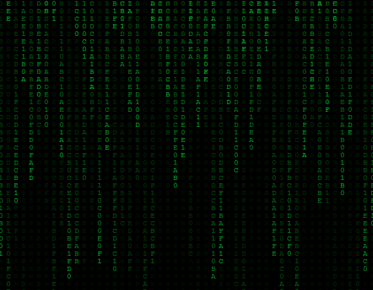

# Matrix Bode

Project I wrote back in 2016 that creates a customizable 'Matrix Code' animation using HTML5 Canvas and JavaScript. The animation features falling characters that can be customized in appearance and behavior.

The inspiration for this project is drawn from the 1999 film _The Matrix_, where Neo discovers his true identity as "the One" and gains the ability to see the world represented in code.



## Features

- **Customizable Text**: Choose the characters that appear in the rain animation.
- **Adjustable Font Size**: Set the size of the falling characters.
- **Color Control**: Customize both the text and background colors.
- **Randomness Factor**: Control the randomness of the falling characters.
- **Responsive Design**: Automatically adjusts to window resizing.

## Usage

To use this animation, simply include the HTML, CSS, and JavaScript files in your project. The main animation is controlled by the `matrix.js` file.

### Customization

You can customize the animation by passing URL parameters:

- `matrixText`: Characters to use in the animation (default: '0101ABCDEF')
- `fontSize`: Size of the characters (default: calculated based on canvas width)
- `random`: Randomness factor (default: 0.95)
- `textColor`: Color of the falling characters (default: '00CC00')
- `backgroundColor`: Background color (default: '0,0,0')

Example URL with custom parameters:

```web
index.html?matrixText=MATRIX&fontSize=15&random=0.98&textColor=FF0000&backgroundColor=0,0,0
```

## Code Structure

- `index.html`: The main HTML file that sets up the canvas.
- `js/matrix.js`: Contains the core logic for the Matrix rain animation.
- `style.css`: Provides styling for the HTML elements.

## Browser Compatibility

This animation uses HTML5 Canvas and modern JavaScript features. It should work in all recent versions of major browsers.
